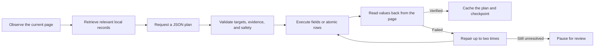

<div align="center">
  
  <h1>Baotian</h1>
  <p><strong>Less repetitive copying, more time for the final review.</strong></p>
  <p>A local-first graduate application form assistant for Chrome, Edge, and Firefox.</p>

  <p>
    
    
    
  </p>

  <p>
    <a href="https://github.com/ironhxs/baoyan-auto-filler/releases/latest"><strong>Download</strong></a>
    · <a href="#quick-start">Quick start</a>
    · <a href="#security-and-privacy">Security</a>
    · <a href="README.md">中文</a>
  </p>
</div>

---

Graduate recommendation and early-admission systems repeatedly ask for the same profile, family, education, language, project, publication, patent, competition, and award data. Baotian keeps those records in the browser and helps inspect, plan, fill, and verify each application page.

Version 2.0 introduces a page-level form Agent. Instead of matching keywords in isolation, it receives the actual page groups, rows, columns, format rules, and only the relevant saved records. This allows one profile to be transformed into different school-specific structures while remaining grounded in stored facts.

<div align="center">
  
  
  
</div>

## Page-level Agent in 2.0

When a saved award record has fields such as title, level, date, organizer, description, and personal rank, but a school asks for only **Date / Place / Content**, the Agent plans one complete row:

- dates are adapted to the page example;
- place uses an organizer or another grounded location-like field when available;
- content combines only relevant saved facts and obeys forbidden-character and length rules;
- all columns in a record are treated atomically, so a partial row is never reported as complete.

The Agent runs inside the extension and uses the OpenAI-compatible relay configured by the user. No Codex desktop integration or local model is required. Both Responses and Chat Completions are supported. Agent requests use streamed plain JSON and are checked locally against a strict schema, page fingerprint, source evidence, and action allowlist. This avoids relying on inconsistent relay-side structured-output support and never changes endpoints or blindly retries authentication, rate-limit, upstream, or network failures.



The popup reports planned actions, readback-verified values, preserved manual edits, review items, failures, retries, and cache reuse. Users can locate a failed field, retry failed actions only, replan the page, or stop the task.

Large repeatable tables are planned in complete-row batches with visible N/M progress. Chromium builds use a hidden extension model bridge so long requests survive Manifest V3 service-worker suspension.

## Managed profile data

Baotian manages seven primary groups:

| Group | Examples |
|---|---|
| Basic information | identity, contacts, address, political status |
| Family members | name, relationship, employer/position, phone |
| Education | school, department, major, GPA, ranking |
| Languages | CET, IELTS, TOEFL, score, date |
| Study and work experience | research, internships, practice, social work |
| Academic work | publications and patents |
| Awards | competitions and university-or-higher honors |

A separate **Education and employment chronology** compatibility group maps start date, end date, school/employer, and role. It is intentionally isolated from research projects and practice records, preventing projects from being inserted into an education timeline.

## Main capabilities

### Reliable page filling

- Deterministic local rules handle exact values such as names, identity numbers, phones, dates, and scores.
- The Agent handles cross-schema conversion, multi-column tables, unfamiliar labels, and long questions.
- Existing values are audited instead of ignored.
- Green means readback verified, orange means review recommended, and red means the page value differs from the plan.
- Clicking an item locates the page control; manual quick fill remains available for unsupported widgets.

### Repeatable records and selectors

- Supports inline tables and Add actions that open a modal or drawer.
- Matches by profile group, record number, and subfield semantics rather than visual column order.
- Search inputs, candidates, and confirmation buttons are scoped to the newly opened selector.
- School, department, and major selectors require a unique candidate and successful page readback.
- React/Vue controlled inputs are updated through native setters and events, followed by a framework readback wait.

### Persistent multi-site tasks

- Work continues after the popup closes or another tab is selected.
- Different schools and projects keep separate page histories, checkpoints, materials, and audit states.
- The current site is shown first; the audit center summarizes the selected batch.
- Only explicit safe next-step controls are eligible.
- Unresolved required fields, materials, page changes, or readback failures pause the task.
- Final submit, confirmation, payment, CAPTCHA, agreement, preference, and advisor actions are never clicked.

### Materials and final audit

- Store and preview JPG, PNG, WebP, and PDF files locally; categorize, rename, and merge PDFs.
- Recommend files from the upload prompt, filename, description, and category.
- A high-confidence candidate may be attached before pausing, but the prompt title and filename are shown for human preview before navigation continues.
- Final audit is manually triggered and read-only. It reviews selected task pages, material records, and deterministic PDF samples through the configured model.

> AI import of profile data from Word/PDF is intentionally not included in 2.0. JSON profile import, document management, and PDF synthesis remain available.

## Quick start

1. Enter the seven profile groups in the workbench or import a JSON backup.
2. Open an application page and choose **Scan and preview** or **Fill in background until final review**.
3. Review all colored states and the final audit report before deciding whether to submit.

### Relay API configuration

- Choose **Responses** for Codex-style models or relays that expose `/responses`.
- Choose **Chat Completions** for traditional OpenAI-compatible endpoints.
- Fast mode adds `service_tier: "fast"`.
- Connection testing sends no profile data. Agent use sends the page structure and only the records required for the current request to the user-selected provider.

## Installation

Download from [GitHub Releases](https://github.com/ironhxs/baoyan-auto-filler/releases/latest):

| File | Browser |
|---|---|
| `baotian-2.0.0-chrome.zip` | Chrome, Edge, Brave, and other Chromium browsers |
| `baotian-2.0.0-firefox.zip` | Firefox temporary loading or later signed distribution |

For Chrome / Edge, extract the archive, open `chrome://extensions/` or `edge://extensions/`, enable Developer mode, and choose **Load unpacked**.

To preserve data during an update, overwrite the files in the same unpacked directory and click **Reload**. Keeping the same directory and extension ID preserves IndexedDB and `chrome.storage` data.

## Security and privacy

- Profile data, documents, task history, and API settings remain in the current browser; the project has no application backend.
- API keys are excluded from profile exports, Git, Agent plan caches, and status summaries.
- Only an explicit AI/Agent action transmits the profile fields, page structure, current URL, and API authentication data required for that request to the model provider configured by the user. The Firefox build declares these transmission types during installation and requires Firefox 140 or newer.
- Model actions may only reference observed page targets and retrieved source records. Invented targets, record IDs, evidence, and click actions are rejected locally.
- Passwords, cookies, authorization data, CSRF values, CAPTCHAs, identity numbers, phone numbers, and raw model responses are excluded from the Agent status view.
- The extension never performs final submission, application confirmation, payment, agreements, preference/advisor selection, or CAPTCHA handling.
- Application systems still differ. The applicant must complete the final review.

## Build from source

```bash
npm install
npm run compile
npm run build
npm run build:firefox
npm run zip
npm run zip:firefox
```

The project uses WXT, TypeScript, IndexedDB, `chrome.storage`, pdf-lib, PDF.js, and pinyin-pro. Agent modules live under `utils/agent/` and cover page snapshots, record retrieval, planning, policy validation, execution, readback verification, caching, recovery, and the status view.

## Contributing

For a new school integration issue, provide sanitized screenshots, field/column labels, the expected mapping, the actual result, and the browser version. Never upload API keys, identity numbers, phone numbers, cookies, credentials, or unsanitized application materials.

## License

[Apache License 2.0](LICENSE)
