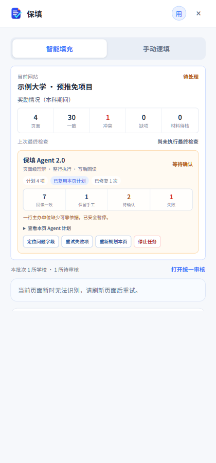
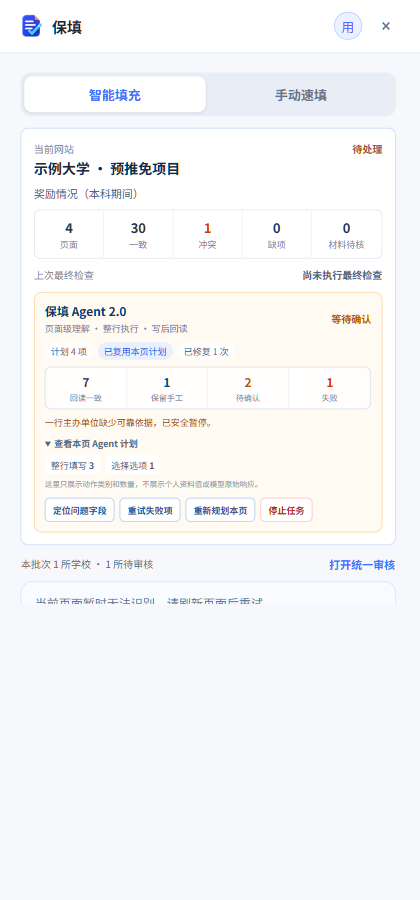
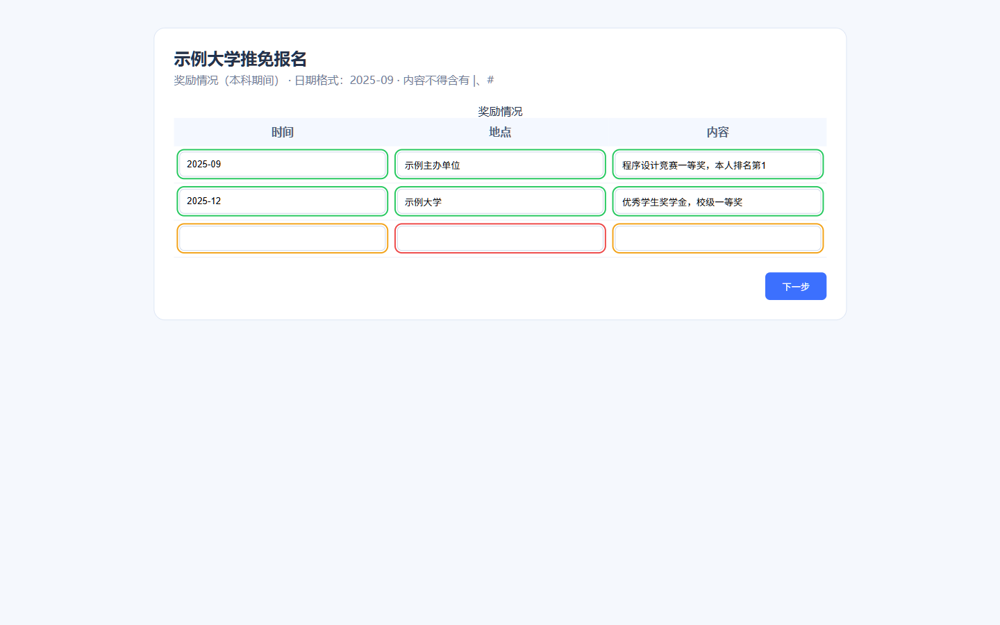
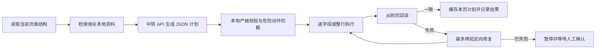

<div align="center">
  
  <h1>保填</h1>
  <p><strong>让推免报名少一点机械复制，多一点最终核对。</strong></p>
  <p>面向 Chrome / Edge / Firefox 的本地优先报名表单助手。</p>

  <p>
    
    
    
    
  </p>

  <p>
    <a href="https://github.com/ironhxs/baoyan-auto-filler/releases/latest"><strong>下载最新版</strong></a>
    · <a href="#三步开始">快速开始</a>
    · <a href="#安全与隐私">安全与隐私</a>
    · <a href="README.en.md">English</a>
  </p>
</div>

---

姓名、家庭成员、学习经历、外语成绩、科研项目、论文专利、竞赛奖励……不同学校反复填写同一批资料，不但耗时，还很容易把日期、排名或某一行内容填错。

保填把常用资料集中保存在浏览器里，并在报名页面中完成识别、规划、填写和写后回读。2.0 引入页面级 Agent：它看到的是页面实际字段、列名、行号、格式限制和相关资料记录，能够把同一份资料转换成不同学校需要的结构，而不是只做关键词对关键词的机械复制。

<div align="center">
  
  
  
</div>

## 2.0：页面级填写 Agent

例如某份本地奖励资料保存为“奖项名称、级别、等级、时间、主办单位、描述、排名”，而学校页面只有“时间、地点、内容”三列。Agent 会先理解这一页的填写风格，再把每一条奖励组织成完整的一行：

- 时间：按页面示例转换为 `YYYY-MM`、`YYYY年M月` 等格式；
- 地点：根据现有资料选择主办单位、赛事地区或可核实的组织信息；没有依据时留待确认，不凭空编造；
- 内容：组合奖项名称、等级、本人排名等相关事实，并遵守页面禁止字符和长度限制；
- 同一条资料的三个子字段作为一个原子行处理，任一列失败就不会把半行当成成功。



Agent 不是 Codex 桌面端，也不需要本地模型。它直接运行在扩展中，使用你在设置里配置的 OpenAI 兼容中转 API；支持 Responses 和 Chat Completions。Agent 请求使用流式普通 JSON，并在扩展本地执行严格 Schema、页面指纹、资料证据和动作白名单校验，避免部分中转对服务端结构化输出支持不稳定。401、403、429、502 或网络错误不会触发偷偷切换线路或盲目重试。

### 看得见、停得住、可以恢复

弹窗会显示本页 Agent 的真实状态：计划动作、回读一致、保留手工、待确认、失败、重试次数和缓存命中。你可以定位失败字段、只重试失败项、重新规划本页或停止任务。

- 每一步都会写入本地断点，关闭弹窗不会丢失执行进度；
- 大型重复表格按完整资料行分批规划，弹窗会显示“已完成 N/M 批”；Chromium 版本使用隐藏的扩展模型桥承载长请求，避免 MV3 后台进程被回收后永久停在“规划中”；
- 同一页面的计划默认缓存 30 分钟，页面、资料、模型、协议或 Fast 设置变化后自动失效；
- 用户手动修改过的值会被保护，返回上一页时不会被旧计划静默覆盖；
- 页面跳转后重新建模，旧页面动作不会在新页面重放；
- 复杂页自动流程直接进入页面 Agent，不再先调用旧匹配器造成双重 API 请求。

## 它能管理什么

工作台集中管理七组推免资料：

| 资料组 | 典型内容 |
|---|---|
| 基本信息 | 姓名、证件、联系方式、地址、政治面貌等 |
| 家庭成员 | 姓名、关系、单位职务、电话等多条记录 |
| 学习信息 | 学校、院系、专业、GPA、排名、推免资格等 |
| 外语水平 | 四六级、雅思、托福及成绩/日期等多条记录 |
| 学习和工作经历 | 科研训练、实习实践、社会工作等精确子字段 |
| 学术成果 | 论文、专利及作者/题目/状态/日期等 |
| 奖励情况 | 学科竞赛与校级以上荣誉奖励 |

另有“学习与工作履历”兼容分组，专门对应“起始时间、结束时间、学校或工作单位、担任职务”这类教育/工作时间线。它与科研项目、实习实践、社会工作严格隔离，不会再拿项目经历去凑学校履历。

同一份资料可以投影到其他网站常见结构，例如：

- 科研训练 → 项目名称、项目描述、项目时间段、本人角色；
- 学科竞赛和荣誉奖励 → 奖项名称、级别、等级、时间、主办单位、描述、本人排名；
- 已发表论文 → 论文名称、类型、发表状态、年月、分区、本人排名；
- 多个子字段 → 学校只提供一个大文本框时，组织成一段可读且有事实依据的文本。

## 核心能力

### 当前页面快速填充

- 本地确定性规则优先处理姓名、证件号、电话、日期、分数等明确字段；
- Agent 处理跨结构转换、多列表格、陌生字段名和长问题；
- 已填写字段也会重新核对，区分一致、冲突、人工值和受保护字段；
- 绿色表示回读一致，橙色表示建议确认，红色表示网页回读与计划不一致；
- 点击结果可定位到网页控件；自动匹配覆盖不到时可使用七类资料的手动速填。

### 复杂记录和选择控件

- 支持页面内多行表格，也支持点击“新增”后出现的弹窗或抽屉；
- 按“资料分组 + 记录序号 + 子字段语义”匹配，不依赖网页列顺序；
- 新增、搜索、候选项和确认按钮严格限制在本次打开的控件范围内；
- 学校、院系、专业等选择器必须命中唯一候选并在网页真实回读后才算成功；
- React / Vue 等受控输入框通过原生 setter 和事件触发，并等待框架回写。

### 后台连续填写和多网站任务

- 关闭弹窗或切换标签后，当前任务仍可在后台继续；
- 多个学校、多个项目分别保存页面记录、断点和审核状态；
- 当前网站的信息优先展示，统一审核中心再汇总本批次全部任务；
- 只点击语义明确的“下一步 / 保存并下一步”；
- 必填项未解决、材料待确认、页面变化或回读失败时暂停；
- 到最终审核页自动停止，绝不点击最终提交、确认报名、支付、验证码、承诺书、志愿或导师选择。

### 材料匹配、预览与最终检查

- 本地管理 JPG、PNG、WebP 和 PDF，可预览、分类、重命名及合并 PDF；
- 根据上传题目、文件名、分类和说明推荐材料；
- 连续填写可先把高置信候选写入文件框，然后暂停，展示“题目名称 + 当前文件名”供本人预览确认；
- 最终检查必须手动触发：汇总所选学校全部页面字段、材料记录和 PDF 抽样页，再发送给所配置的模型做只读复核；
- 最终检查不会修改字段、替换文件、点击下一步或执行任何提交。

> 2.0 暂不开发 Word / PDF 个人资料的 AI 自动导入。资料 JSON 导入、证明材料管理和 PDF 合成功能不受影响。

## 三步开始

1. 在工作台录入七类资料，或导入已有 JSON；录入后先导出一份本地备份。
2. 打开学校报名页，点击扩展图标，选择“识别并预览”或“后台连续填写到最终审核”。
3. 根据绿色、橙色、红色状态和最终检查报告逐项审核，再由本人决定是否提交。

### 配置中转 API

设置页支持自定义 Base URL、API Key、模型、协议和 Fast 模式：

- Codex 类模型或只支持 `/responses` 的线路选择 `Responses`；
- 传统 OpenAI 兼容线路可以选择 `Chat Completions`；
- Fast 模式开启后请求携带 `service_tier: "fast"`；
- “测试连接”不发送个人资料；真正使用 Agent 时，当前页面结构和完成本次任务所需的相关资料会发送到所配置的模型服务商。

## 安装

前往 [GitHub Releases](https://github.com/ironhxs/baoyan-auto-filler/releases/latest) 下载：

| 文件 | 浏览器 |
|---|---|
| `baotian-2.0.0-chrome.zip` | Chrome、Edge、Brave 等 Chromium 浏览器 |
| `baotian-2.0.0-firefox.zip` | Firefox 临时加载或后续签名发布 |

Chrome / Edge：

1. 解压下载的 zip；
2. 打开 `edge://extensions/` 或 `chrome://extensions/`；
3. 开启“开发人员模式”；
4. 点击“加载解压缩的扩展”，选择解压后的目录。

### 更新时如何保留资料

不要删除旧扩展，也不要每次换一个加载目录。把新版本覆盖到原来的解压目录，再在扩展管理页点击“重新加载”，最后刷新报名网页。只要加载目录和扩展 ID 不变，IndexedDB 与 `chrome.storage` 中的资料、材料和 API 设置就会保留。

如果重新加载后仍显示旧版本：

1. 在扩展详情页确认“加载位置”是不是刚刚覆盖的目录；
2. 打开该目录的 `manifest.json`，确认 `version` 为 `2.0.0`；
3. 完全退出浏览器后重开，再点一次“重新加载”；
4. 仍无效时先导出备份，再移除旧扩展并重新加载正确目录。

## 安全与隐私

- 资料、材料、任务记录和 API 设置默认保存在当前浏览器；项目没有自建业务服务器；
- API Key 只用于浏览器向你指定的模型服务商发起请求，不会写入资料备份、Git 仓库、Agent 缓存或状态面板；
- 只有主动使用 AI/Agent 功能时，完成当前请求所需的资料字段、页面结构、当前网址和 API 认证信息才会发送到你配置的模型服务商；Firefox 构建会在安装时明确声明这些数据传输类型，并要求 Firefox 140 或更高版本；
- Agent 计划只允许已扫描到的字段、已检索到的资料记录和受支持动作；模型编造的字段、资料 ID 或点击动作会被拒绝；
- 身份证号、手机号、密码、Authorization、Cookie、CSRF、验证码和原始模型响应不会出现在 Agent 状态摘要中；
- 文件下载与最终检查只使用页面中用户可见、同源且可读取的入口，不携带隐藏会话字段给模型；
- 扩展不会自动提交、确认报名、支付、接受承诺、选择志愿/导师或处理验证码；
- 不同学校仍可能有特殊校验，所有内容必须由申请人最终检查。

## 从源码构建

```bash
npm install
npm run compile
npm run build
npm run build:firefox
```

打包：

```bash
npm run zip
npm run zip:firefox
```

开发模式：

```bash
npm run dev
npm run dev:firefox
```

核心技术：WXT、TypeScript、IndexedDB、`chrome.storage`、pdf-lib、PDF.js、pinyin-pro。Agent 相关代码位于 `utils/agent/`，覆盖页面快照、资料检索、计划解析、策略校验、执行、回读、缓存、恢复和状态视图。

## 贡献与反馈

遇到新学校页面时，建议在 Issue 中提供：脱敏后的页面截图、字段标题/列名、预期资料映射、实际结果和浏览器版本。不要上传 API Key、身份证号、手机号、Cookie、登录凭证或未脱敏材料。

## License

[Apache License 2.0](LICENSE)
